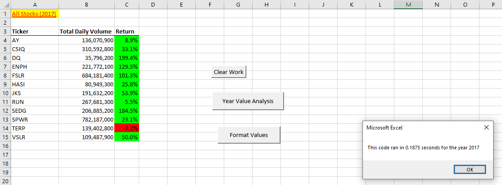
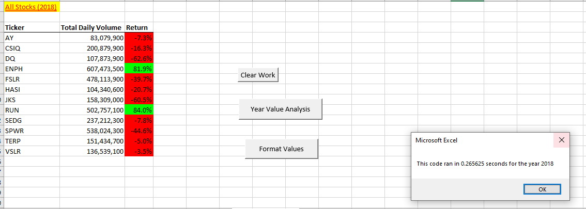

# stock-analysis

## Overview of Project

### Purpose

The initial purpose of the project was to help Steve write a script that calculated the total daily volume and the percent return for each of the 11 stocks that his parents were interested in following for the years of 2017 and 2018.  

Once the code was succefully writen to complete the analysis, the code was rewriten (refactored) to try to improve the time it took for the analysis to complete (for the code to run).

## Results

### Analysis of 2017 stock

The analysis shows that with the exception of the "TERP" stock, all stocks had a positive return for the year of 2017.  
The median return was 41.5% and the mean return was 67.3%.

With the refactored code, the time to run the analysis for the year of 2017 and generate the same results decreased ~4.9x from ~0.921875 seconds to 0.1875 seconds:



### Analysis of 2018 stock

The analysis shows that in 2018 ten out of twelve stocks had negative returns.  
The median return was -12%. The mean return was -8.5%.
The only two stocks with positive returns were "ENPH" and "RUN" with returns of 81.9% and 84.0%.

With the refactored code, the time to run the analysis for the year of 2018 and generate the same results decreased ~3x from ~0.796875 seconds to 0.265625 seconds:



### Significant Code Refactoring that led to improved performance

The most important change made to the original code was to create a ticker index ('''tickerIndex''') and 3 arrays: for the Stock ticker daily Volume ('''tickerVolumes'''), for the starting price of the stock ('''tickerstartingprices''') and for the ending price of the stock ('''tickerEndingPrices''').

an example of a such statement: ```=COUNTIFS(Data!R:R,"plays",Data!$D:$D,">=25000",Data!$D:$D,"<=29999",Data!$F:$F,"Canceled")```


## Summary

### Advantages and disadvantages of refactoring code in general
The advantages of refactoring code potentially include:
1. make code run faster,
2. make code easier to follow by adding additional comments,
3. make code easier to change and mantain by reducing duplicates.

The disadvantages of refactoring code potentially include:
1. It takes time to refactor code,
2. It may introduce bugs if not checked carefully.

### Advantages and disadvantages of refactoring code in general
In this particular case the refactoring of the code significantly improved the time it took to perform the stock analysis.

